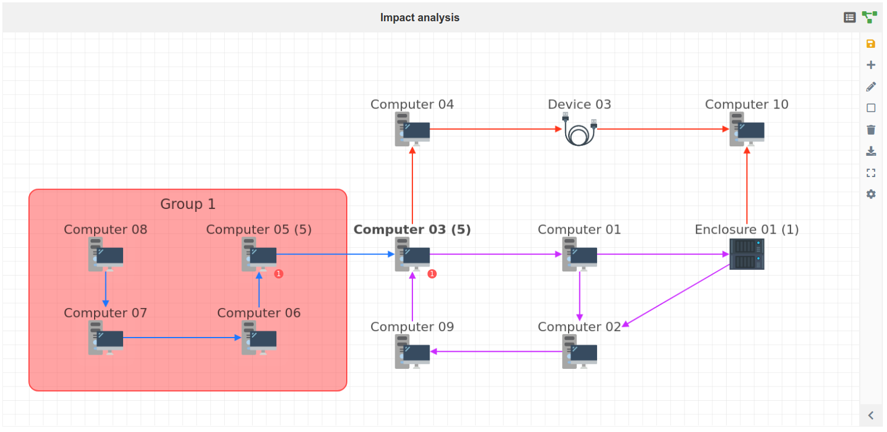

Introduction
==========

The impact analysis module allow you to consult and interact with the different
dependencies of a given GLPI object.

In a standard GLPI installation, the impact analysis is enabled for the
following objects:

- Computers
- Devices
- Enclosures
- Monitors
- Network devices
- Phones
- Printers
- Server rooms
- Softwares
- Racks

Each of these objets types will feature an "Impact analysis" tab:

The number on the right of the tab label is the number of direct dependencies
of the current asset.

PS: the list above can be modified or extended by the installed plugins.

List view
----------------------

The "Impact analysis" tab contains two viewing mode: "list" and "graph".
The list view looks like this:

This view contains two major blocks:

* the assets that are impacted by the current
* the assets that impact the current item.

The assets in each blocks are grouped by their types and indicate their
relations in regard to the current item (shown in bold).
The number of ongoing incidents, problems and changes related to this asset are
also shown and they can be accessed by clicking the number.

Graph view
----------------------

The graph view show the impact network for the current item:

More details on how to read, update or configure the graph can be found in the
following chapters.