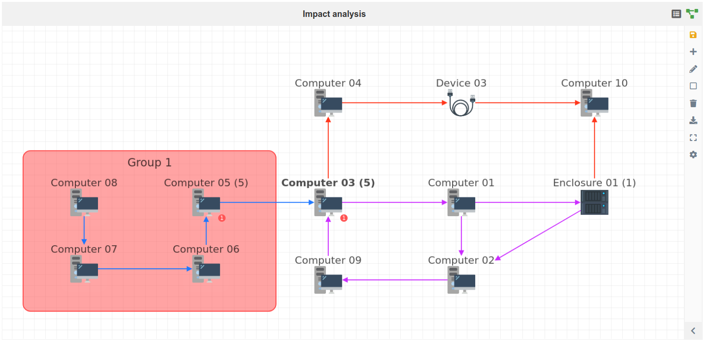
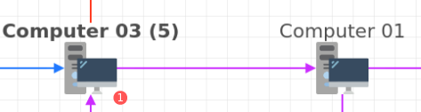
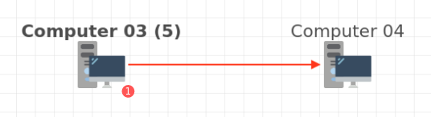
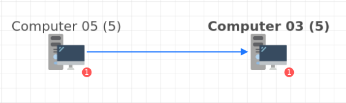
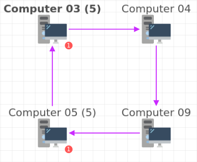
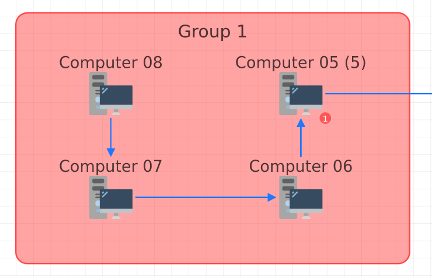
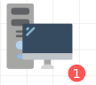
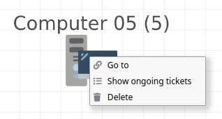

Reading the impact graph
=========

Current item
-------------

The current item is shown in bold on the graph:

Assets impacted by the current item
-----------------

Assets impacted by the current item are linked by a red arrow:

Assets that impact the current item
---------------

Assets that impact the current item are linked by a blue arrow:

Assets that impact and depends on the current item
---------------

Assets that impact and depends on the current item are linked by a purple arrow.

Groups
----------

Assets can be part of a group.
A group is defined by a name and a color.

Ongoing incidents
----------

If an asset has one or multiple ongoing incidents, a small "badge" will appear
near its representation on the graph.
This badge contains the number of incidents and it's color match the highest
priority amongst them.
The badge can be clicked to access the list of these incidents

Ongoing tickets
----------

If an asset has one or multiple tickets (incidents, requests, changes or
problems), their number will be indicated after its name.

More details abouts these tickets can be found through the "Show ongoing
tickets"
item of the right click contextual menu.

